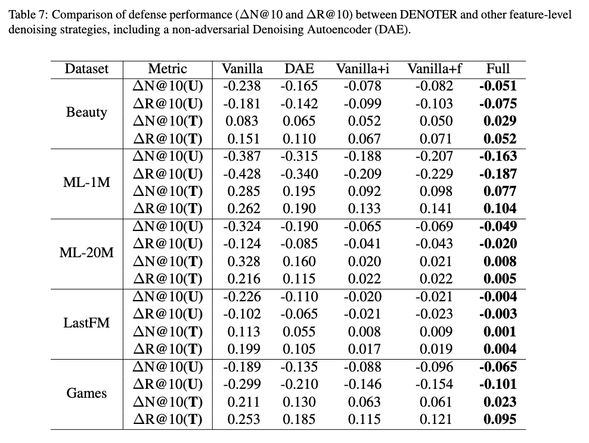
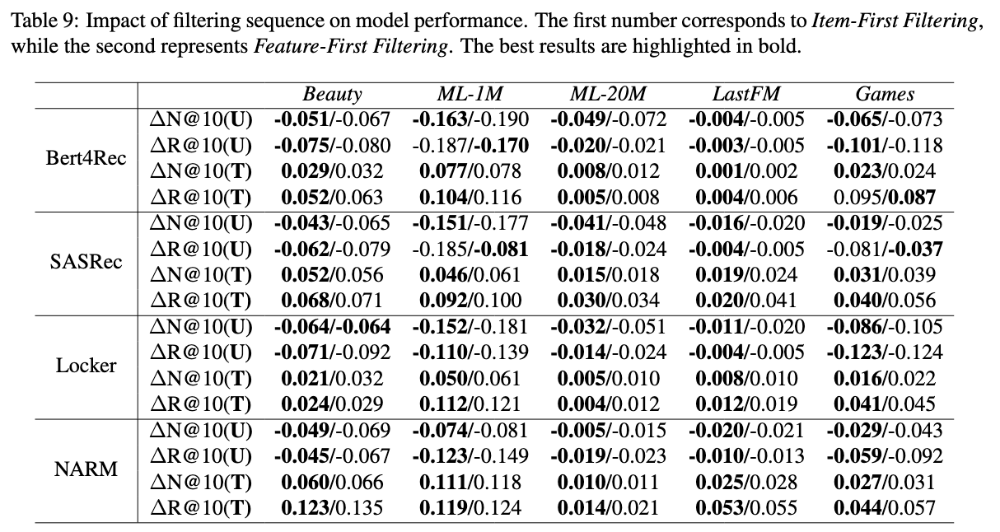
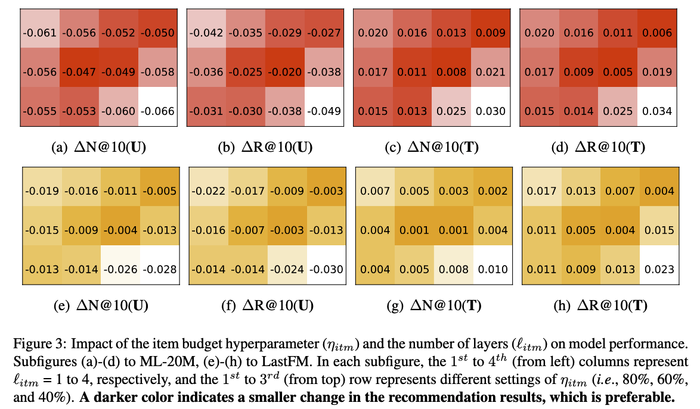
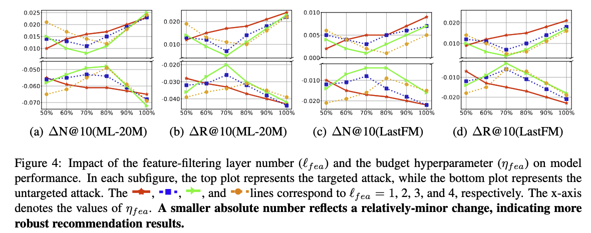
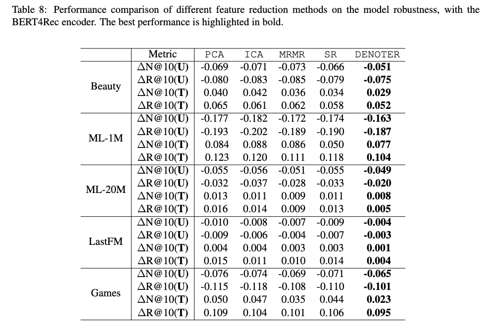
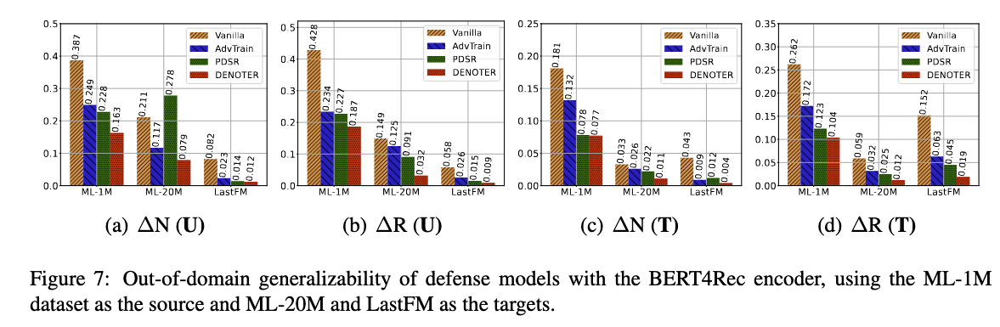

## Experiments Settings

**DENOTER** is compared to the following defense approaches: **CASR**, **Dirichlet**, **AdvTrain**, **RVD**, **FINEST**, and **PDSR**. 
Specifically, we reproduce the results for Dirichlet/AdvTrain, RVD, FINEST, and PDSR by either directly referencing their reported results (when available) or by utilizing their open-source code with default experimental settings. Since the source code for CASR is not publicly available, we implement it ourselves. Specifically, for CASR, we use 80\% of the training set to generate perturbed sequences, with a confidence threshold of 0.5 and an intervention ratio within the range of $[-6,-1]$. For Dirichlet and AdvTrain, we set the number of hidden units to 64, a dropout rate of 0.1, and a masking probability of 0.2. For RVD, the training-to-validation ratio is set at 90%:10%, with noise generated using a truncated normal distribution $\mathcal{N}(0, 0.01)$ and a maximum noise value of $2.5 \times 10^{-2}$. For FINEST, a simulated perturbation ratio of 0.01 is applied to the reference list, and the Top-100 items are used for regularization. For PDSR, we configure the MLP hidden layer with 1000 neurons, set the gating variable to 0.5, and use the Kullback-Leibler (KL) divergence for encoding alignment. Additionally, we implement a \textbf{Vanilla} model as a reference, which operates without any defense mechanisms.

#### 4.3.1 On the model breakdown

Following table is the completed experiment reults, which includes all the datasets and the results of $\Delta R@10$ .

#### 4.3.2 On the order of item/feature filtering

Follwing table is the completed experiment results for all datasets and the results of $\Delta R@10$. 

#### 4.3.3 iltering hyperparameter sensitivity analysis

##### On the item-filtering layer

##### On the feature-filtering layer

#### 4.3.4 On item and feature engineering

#### 4.3.8 On out-of-domain generalizabilityML-1M ML-20M LastFM

